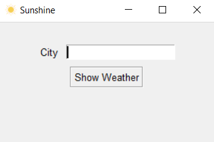
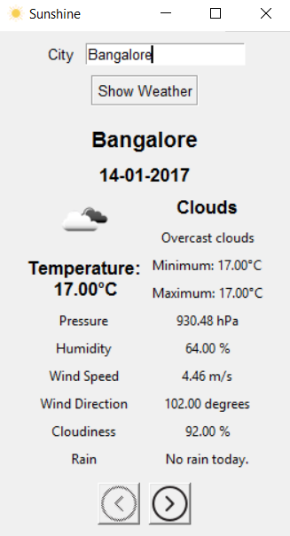

# Sunshine
A simple weather GUI app with Tkinter that fetches weather data from openweathermap API.

## How to use it?
Windows users can download the binary from [release](https://github.com/DevipriyaSarkar/Sunshine/releases).  
Extract the zip and open ```weather.exe```.

## Setup Instructions
1. Make sure python 2.7 is installed on your system.
2. Clone the repository.
3. Install all the packages in ```requirements.txt```.  
 To install using pip on command line, run ```pip install -r requirements.txt```.
4. Add your OpenWeatherMap API key to ```keys.py```. It can be obtained from [here](http://openweathermap.org/appid).
5. Run ```weather.py```,  
 ```
 python weather.py
 ```
6. [Optional] To build the .exe file, run  
 ```
 python setup.py build
 ```  
 Check ```<project-location>\build\exe.win32-2.7\weather.exe```.

## Screenshots

  


## License
The content of this repository is licensed under [MIT LICENSE](LICENSE.MD).
